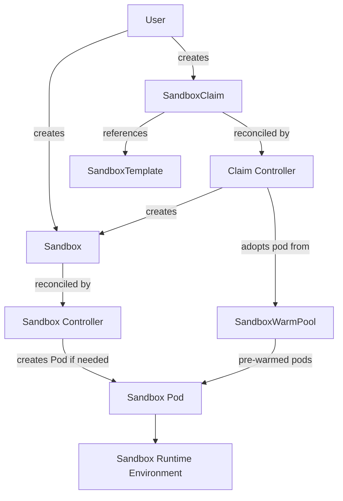

# EKS + Karpenter + Agent Sandbox

Deploy production-ready EKS clusters with single-EC2-per-Pod isolation using Karpenter and Agent Sandbox warm pools.

## Architecture

### Infrastructure

```
                     +---------------------------+
                     |     EKS Control Plane      |
                     |       (EKS 1.34)           |
                     +---------------------------+
                                |
               +----------------+----------------+
               |                                 |
     +---------+----------+           +----------+---------+
     | Managed Node Group |           |  Karpenter Nodes   |
     |   (m5.large x2)    |           | (INSTANCE_TYPE x N)|
     |  system workloads   |           |  1 pod per node    |
     +--------------------+           +--------------------+
                                              |
                                    +---------+---------+
                                    |  Agent Sandbox    |
                                    |  Warm Pool (N)    |
                                    |                   |
                                    | SandboxClaim -->  |
                                    | instant pod bind  |
                                    +-------------------+
```

### Agent Sandbox Workflow



## Repository Structure

```
eks-skill/
├── setup_guide.md                      # Step-by-step deployment guide (11 steps)
├── sandbox_usage_guide.md              # Agent Sandbox usage, tests & API reference
├── tests/
│   ├── test-all.sh                     # Validation test suite (15 tests)
│   └── fault-tolerance-tests.md        # Fault tolerance tests (T1-T8) reproduction guide
└── README.md
```

## What This Deploys

- **EKS 1.34** cluster with VPC (3 public + 3 private subnets, single NAT Gateway)
- **Karpenter v1.9.0** for node autoscaling with single-pod-per-node isolation
- **Agent Sandbox v0.2.1** with warm pool for sub-2s sandbox claim latency
- **EBS CSI Driver** + **ALB Controller** as add-ons
- Worker nodes in **private subnets only**

## Instance Type Profiles

| Profile | INSTANCE_TYPE | vCPU / RAM | SandboxTemplate Resources | Use Case |
|---------|---------------|------------|---------------------------|----------|
| **Standard** | `m5.xlarge` | 4 vCPU / 16GB | cpu: 3500m, mem: 12Gi | Production workloads |
| **Low-spec** | `t3.medium` | 2 vCPU / 4GB | cpu: 1, mem: 2Gi | Dev/test, cost-sensitive |

Both profiles verified: pods run successfully with 1 pod per dedicated node.

## Key Features

- **Region-portable**: Works in any AWS commercial region (auto-detects AZs)
- **Account-portable**: No hardcoded account IDs; uses `${AWS_ACCOUNT_ID}`, `${AWS_PARTITION}`
- **Single-pod-per-node isolation**: Triple guarantee via node taint + pod anti-affinity + resource sizing
- **Warm pool**: Pre-provisioned sandboxes for instant (~1-2s) claim vs ~90s cold start

## Fault Tolerance Test Results

8 tests covering warm pool resilience, claim lifecycle, and EBS data persistence.

| # | Test | Result | Recovery |
|---|------|--------|----------|
| T1 | Warm Pool Pod Deletion | **PASS** | ~5s auto-recovery |
| T2 | EC2 Node Termination | **PASS** | ~56s new node |
| T3 | Claim + Pool Backfill | **PASS** | ~10s backfill |
| T4 | Pool Exhaustion (Cold Start) | **PASS** | ~45s cold start |
| T5 | Claimed Pod Deletion | **WARN** | No auto-recovery |
| T6 | Burst Claims + Release | **PASS** | ~25s stabilize |
| T7 | EBS Volume Mount (5Gi) | **PASS** | ~55s with EBS |
| T8 | Node Kill on Claimed EBS Sandbox | **FAIL** | Claim + data lost |

**Key findings**:
- Warm pool is fully self-healing (T1/T2/T3/T6)
- Active Claims do NOT self-heal after pod loss (T5/T8) — application-layer retry required
- Ephemeral EBS data is lost with pod (T8) — use S3 backups for critical data; `volumeClaimTemplates` support pending ([#225](https://github.com/kubernetes-sigs/agent-sandbox/issues/225))

Full reproduction scripts: [tests/fault-tolerance-tests.md](tests/fault-tolerance-tests.md)

## Quick Start

1. Follow **[setup_guide.md](setup_guide.md)** for the full 11-step deployment
2. Set your parameters:
   ```bash
   export AWS_DEFAULT_REGION="us-west-2"
   export CLUSTER_NAME="my-agent-cluster"
   export INSTANCE_TYPE="m5.xlarge"    # or t3.medium for low-cost
   ```
3. After deployment, see **[sandbox_usage_guide.md](sandbox_usage_guide.md)** for sandbox operations

## Guides

- **[Setup Guide](setup_guide.md)**: Prerequisites, parameters, step-by-step deployment, troubleshooting, cleanup, and cost estimates.
- **[Sandbox Usage Guide](sandbox_usage_guide.md)**: Concepts, SandboxTemplate/WarmPool/Claim usage, monitoring, fault tolerance test results, advanced use cases, and full API reference.

## Test Suites

### Validation Tests (15 tests)

```bash
TEST_REGION=<your-region> TEST_CLUSTER_NAME=<your-cluster> bash tests/test-all.sh
```

- **Karpenter** (5): scale-out, single-pod-per-node, private subnets, taints, scale-in
- **ALB Controller** (4): deployment health, IngressClass, ALB provisioning, HTTP response
- **Agent Sandbox** (6): controller health, warm pool ready, claim latency, backfill, burst claims, cleanup

### Fault Tolerance Tests (T1-T8)

Manual reproduction guide: [tests/fault-tolerance-tests.md](tests/fault-tolerance-tests.md)

Covers: pod deletion recovery, node failure, claim lifecycle, pool exhaustion, burst scaling, EBS mount, and the worst-case node-kill-on-claimed-EBS scenario.

## Cost Estimate

| Profile | Idle cost (2 warm pool pods) | Daily |
|---------|------------------------------|-------|
| Standard (m5.xlarge) | ~$0.72/hr | ~$17/day |
| Low-spec (t3.medium) | ~$0.42/hr | ~$10/day |

Scale warm pool to 0 when not in use to reduce to ~$0.34/hr.
